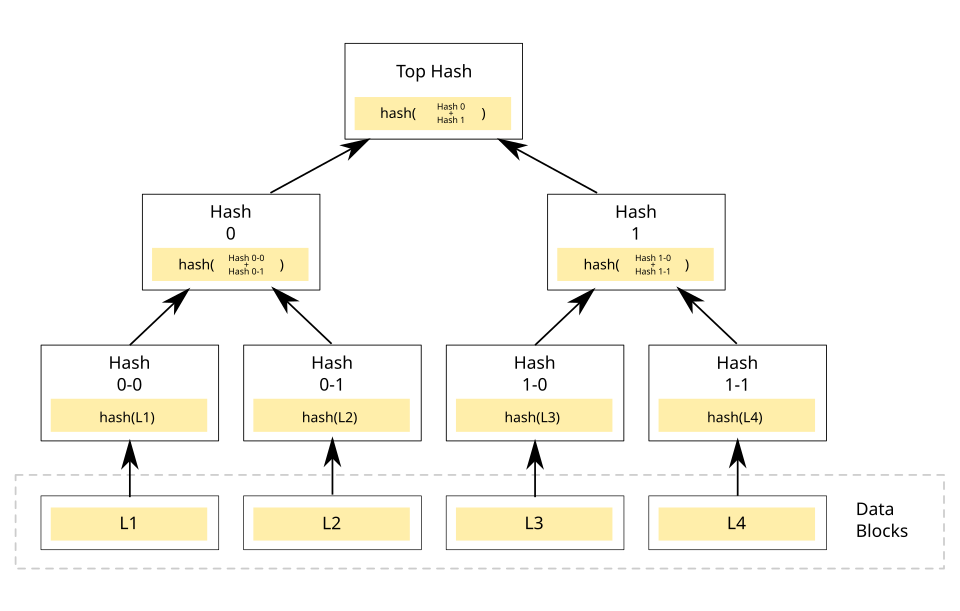
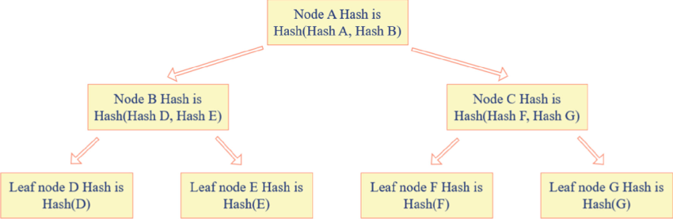

# A Merkle / Hash Tree Experiment with the Ruby Programming Language

THIS IS A WORK IN PROGRESS - A self teaching exercise.

## What is a Merkle Tree?





A Merkle Tree, often referred to as a hash tree, represents a fundamental data structure in computer science and cryptography. 

Its structure is hierarchical, resembling an inverted tree. At the base of this tree are the "leaf" nodes, each containing a cryptographic hash derived from a distinct block of data. Moving upwards, every node that is not a leaf—termed an internal node, branch, or inode—stores a cryptographic hash computed from the combined hashes of its direct child nodes.

The primary function of a Merkle Tree is to enable the efficient and secure verification of large datasets. 

By summarizing potentially vast amounts of data into a single root hash, it allows parties to confirm data integrity without transmitting the entire dataset. 

This structure serves as a more sophisticated evolution of simpler concepts like hash lists or hash chains. 

Its utility is demonstrated in numerous real-world systems requiring robust data verification, including prominent blockchains like Bitcoin and Ethereum, distributed databases such as Apache Cassandra, and version control systems like Git, primarily for ensuring data integrity and facilitating efficient synchronization between distributed copies of data.

This implementation illustrates the core principles of a Merkle Tree:

```ruby
require 'digest'

class MerkleTree
  attr_reader :root

  def initialize(data_list)
    leaves = data_list.map { |data| Digest::SHA256.hexdigest(data) }
    @root = build_tree(leaves)
  end

  private

  def build_tree(nodes)
    return nodes.first if nodes.size == 1

    # If odd number of nodes, duplicate last node
    nodes << nodes.last if nodes.size.odd?

    parent_nodes = []

    nodes.each_slice(2) do |left, right|
      combined = left + right
      parent_nodes << Digest::SHA256.hexdigest(combined)
    end

    build_tree(parent_nodes)
  end
end

# Example usage
data = ["a", "b", "c", "d"]
tree = MerkleTree.new(data)
puts "Merkle Root: #{tree.root}"

```

- Each data item is hashed (SHA256).
- Leaves are paired, concatenated, and then hashed again to form parent nodes.
- If there is an odd number of nodes, the last one is duplicated to make a pair.
- This continues until a single root hash remains: 
**The Merkle Root**

